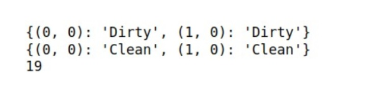

## ExpNo 1 :
Developing AI Agent with PEAS Description</h1>
## Name: 
PRAGATHI KUMAR
## Register Number:
 212224230200


## AIM:
To find the PEAS description for the given AI problem and develop an AI agent.
## Theory:
Medicine prescribing agent:
Such this agent prescribes medicine for fever (greater than 98.5 degrees) which we consider here as unhealthy, by the user temperature input, and another environment is rooms in the hospital (two rooms). This agent has to consider two factors one is room location and an unhealthy patient in a random room, the agent has to move from one room to another to check and treat the unhealthy person. The performance of the agent is calculated by incrementing performance and each time after treating in one room again it has to check another room so that the movement causes the agent to reduce its performance. Hence, agents prescribe medicine to unhealthy.

## PEAS DESCRIPTION:


## DESIGN STEPS:
STEP 1:Identifying the input:
Temperature from patients, Location.
STEP 2:Identifying the output:
Prescribe medicine if the patient in a random has a fever.
STEP 3:Developing the PEAS description:
PEAS description is developed by the performance, environment, actuators, and sensors in an agent.
STEP 4:Implementing the AI agent:
Treat unhealthy patients in each room. And check for the unhealthy patients in random room
STEP 5:
Measure the performance parameters: For each treatment performance incremented, for each movement performance decremented
## Program
```
    import random
    import time 
    class Thing:
        """
        This represents any physical object that can appear in an Environment.
        """
        def is_alive(self):
            """Things that are 'alive' should return true."""
            return hasattr(self, "alive") and self.alive

    def show_state(self):
        """Display the agent's internal state. Subclasses should override."""
        print("I don't know how to show_state.")

    class Agent(Thing):
        """
        An Agent is a subclass of Thing.
        """
        def __init__(self, program=None):
            self.alive = True
            self.performance = 0
            self.program = program

    def can_grab(self, thing):
        """Return True if this agent can grab this thing. Override for appropriate behavior."""
        return False

    def TableDrivenAgentProgram(table):
        """
        This agent selects an action based on the percept sequence.
        To customize it, provide as table a dictionary of all {percept_sequence:action} pairs.
        """
        percepts = []

    def program(percept):
        percepts.append(percept)
        action = table.get(tuple(percepts), None)
        return action

    return program

    loc_A, loc_B = (0, 0), (1, 0)  # The two locations for the Vacuum cleaning
    
    def TableDrivenVacuumAgent():
        """
        Tabular approach towards Vacuum cleaning
        """
        table = {
            ((loc_A, "Clean"),): "Right",
            ((loc_A, "Dirty"),): "Suck",
            ((loc_B, "Clean"),): "Left",
            ((loc_B, "Dirty"),): "Suck",
            ((loc_A, "Dirty"), (loc_A, "Clean")): "Right",
            ((loc_A, "Clean"), (loc_B, "Dirty")): "Suck",
            ((loc_B, "Clean"), (loc_A, "Dirty")): "Suck",
            ((loc_B, "Dirty"), (loc_B, "Clean")): "Left",
            ((loc_A, "Dirty"), (loc_A, "Clean"), (loc_B, "Dirty")): "Suck",
            ((loc_B, "Dirty"), (loc_B, "Clean"), (loc_A, "Dirty")): "Suck",
        }
        return Agent(TableDrivenAgentProgram(table))
    
    class Environment:
        """Abstract class representing an Environment. 'Real' Environment classes will subclass this."""
        def __init__(self):
            self.things = []
            self.agents = []

    def percept(self, agent):
        """Return the percept that the agent sees at this point."""
        raise NotImplementedError

    def execute_action(self, agent, action):
        """Change the world to reflect this action."""
        raise NotImplementedError

    def default_location(self, thing):
        """Default location to place a new thing with unspecified location."""
        return None

    def is_done(self):
        """By default, we're done when we can't find a live agent."""
        return not any(agent.is_alive() for agent in self.agents)

    def step(self):
        """Run the environment for one time step."""
        if not self.is_done():
            actions = []
            for agent in self.agents:
                if agent.alive:
                    actions.append(agent.program(self.percept(agent)))
                else:
                    actions.append(None)
            for (agent, action) in zip(self.agents, actions):
                if action:
                    self.execute_action(agent, action)

    def run(self, steps=1000):
        """Run the Environment for a given number of time steps."""
        for step in range(steps):
            if self.is_done():
                return
            self.step()

    def add_thing(self, thing, location=None):
        """Add a thing to the environment, setting its location."""
        if not isinstance(thing, Thing):
            thing = Agent(thing)
        if thing in self.things:
            print("Can't add the same thing twice")
        else:
            thing.location = location if location is not None else self.default_location(thing)
            self.things.append(thing)
            if isinstance(thing, Agent):
                thing.performance = 0
                self.agents.append(thing)

    def delete_thing(self, thing):
        """Remove a thing from the environment."""
        try:
            self.things.remove(thing)
        except ValueError as e:
            print(e)
            print(" in Environment delete_thing")
        if thing in self.agents:
            self.agents.remove(thing)

    class TrivialVacuumEnvironment(Environment):
        """This environment has two locations, A and B. Each can be clean or dirty."""
        def __init__(self):
            super().__init__()
            self.status = {loc_A: random.choice(["Clean", "Dirty"]), loc_B: random.choice(["Clean", "Dirty"])}

    def percept(self, agent):
        """Returns the agent's location, and the location status (Dirty/Clean)."""
        return agent.location, self.status[agent.location]

    def execute_action(self, agent, action):
        """Change agent's location and/or location's status; track performance."""
        if action == "Right":
            agent.location = loc_B
            agent.performance -= 1
        elif action == "Left":
            agent.location = loc_A
            agent.performance -= 1
        elif action == "Suck":
            if self.status[agent.location] == "Dirty":
                agent.performance += 10
                self.status[agent.location] = "Clean"

    def default_location(self, thing):
        return random.choice([loc_A, loc_B])

    if __name__ == "__main__":
        agent = TableDrivenVacuumAgent()
        environment = TrivialVacuumEnvironment()
        environment.add_thing(agent)
        print("Initial Status:", environment.status)
        environment.run(steps=10)
        print("Final Status:", environment.status)
        print("Agent Performance:", agent.performance)
```
## Output:

## Result:
 An AI Agent with PEAS Description is developed.